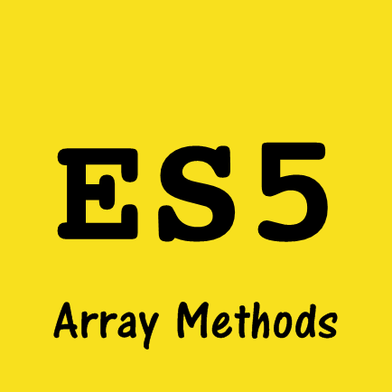
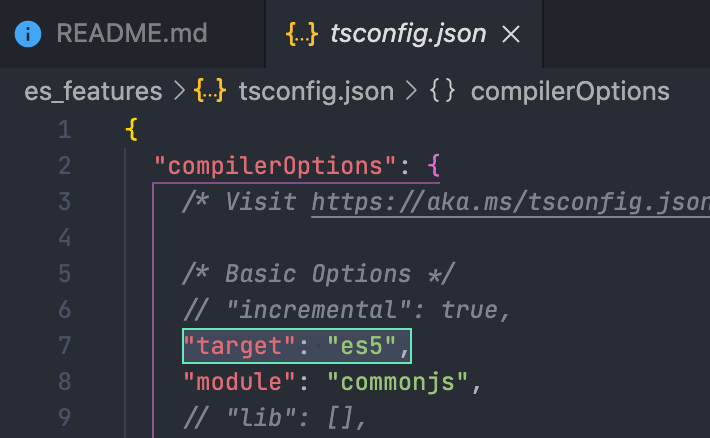

# ECMAScript 5

  
_[사진 출처](https://paperblock.tistory.com/67)_


## 🚀 Intro

`ES5`는 2009년도에 발표된 ECMAscript 5 의 줄임 표현으로,  
**IE9 🤪** 에서 `'use strict'`를 지원하지 않는 것을 제외하고는 대부분의 브라우저 버전에서 `ES5` 문법을 지원한다는 점이 특징입니다.

> _typescript_ 에서도 default target 이 `es5` 인 것을 볼 수 있습니다.



## 👀 ES5 주요 특징들

- ['use strict'](#use-strict)
- [String.trim()](#stringtrim)
- [Array.isArray()](#arrayisarray)
- [Array.forEach()](#arrayforeach)
- [Array.map()](#arraymap)
- [Array.filter()](#arrayfilter)
- [Array.reduce()](#arrayreduce)
- [Array.reduceRight()](#arrayreduceright)
- [Array.every()](#arrayevery)
- Array.some()
- Array.indexOf()
- Array.lastIndexOf()
- JSON.parse()
- JSON.stringify()
- Date.now()

### 'use strict'

#### What is strict-mode

🧐 말 그대로 엄격 모드입니다.  
반대 표현으로는 '느슨한 모드(sloppy mode)' 라고 부르기도 합니다.

기존의 느슨한 JS의 문법들을 엄격하게 검열한다고 생각하시면 될 것 같습니다.

1. 기존에는 **조용히** 무시되던 에러들을 _throwing_ 합니다.
2. _JavaScript_ 엔진의 최적화 작업을 어렵게 만드는 실수들을 바로 잡습니다.  
   가끔씩 **엄격모드**의 코드는 **비-엄격** 모드의 동일한 코드보다 더 빨리 작동하도록 만들어집니다.
3. 엄격 모드는 ECMAScript의 차기 버전들에서 정의 될 문법들을 금지합니다.

#### 엄격모드 적용하기

전체 스크립트를 엄격 모드로 적용하기 위해선  
script 최상단에 `'use strict';` 구문을 적어주면 됩니다.

```Javascript
'use strict';
// some code
```

함수에 엄격 모드를 적용하기 위해선  
함수 본문 처음에 `'use strict';`을 적어주면 됩니다.

```Javascript
function add(){
    'use strict';
    return "덧셈 안 해"
}
```

ES6 (ECMA2015)에 도입된 모듈에서는 엄격 모드 시작을 위한 구문 없이도  
자동으로 엄격모드입니다.

#### 조용한 에러들

> 엄격 모드와 비엄격 모드의 차이중 몇 개를 뽑아서 정리했습니다.  
> 더 많은 특징들은 [MDN 공식 문서](https://developer.mozilla.org/ko/docs/Web/JavaScript/Reference/Strict_mode) 에서 확인하시기 바랍니다.

##### 1. 선언하지 않은 variable, object를 사용/수정/삭제 할 수 없다

🤪 느슨한 모드

```JavaScript
// "use strict";

이거_선언_되는_거였어 = 10;
console.log(이거_선언_되는_거였어); // 10
```

🧐 엄격 모드

```JavaScript
"use strict";

이거_선언_되는_거였어 = 10; // error
console.log(이거_선언_되는_거였어);
```

##### 2. `with` statement

엄격 모드에서는 `with` 를 사용하지 못하게 합니다.  
런타임중에 블록 안의 모든 이름이 전달된 객체의 프로퍼티나 (또는 전역) 스코프 내의 변수로 매핑 될 수 있다는 것입니다.

🤪 느슨한 모드

```JavaScript
function cos(number) {
    console.log(number);
}

with (Math) {
    x = cos(2 * PI);
}
console.log(x); // 1
```

🧐 엄격 모드

```JavaScript
"use strict";

function cos(number) {
    console.log(number);
}

// error
with (Math) {
    x = cos(2 * PI);
}
console.log(x);
```

[목록으로](#-es5-주요-특징들)

### string.trim()

양 끝에서 공백을 제거한 새로운 문자열을 반환합니다.  
인자로 받을 수 있는 것은 없습니다.

> 파이썬의 `strip()` 에게 공백을 인자로 준 것과 같은 역할입니다.

```Javascript

var a = " 누가 이렇게 저장을 해 "

console.log(a.trim()) // "누가 이렇게 저장을 해"
console.log(a) // " 누가 이렇게 저장을 해 "
```

[목록으로](#-es5-주요-특징들)

### Array.isArray()

이 메서드는 전달받은 인자가 Array인지 판별합니다.

#### 🏄‍♂️ Array.isArray() 예제

```Javascript
// Array.isArray(obj: Object): boolean

var a = Array;
var _a = Object;
var newArray = new Array();
var proto = Array.prototype;
var b = [];
var c = {};

console.log(Array.isArray(a)); // false
console.log(Array.isArray(_a)); // true
console.log(Array.isArray(newArray)); // true
console.log(Array.isArray(proto)); // true
console.log(Array.isArray(b));  // false
console.log(Array.isArray(c)); // false
```

[목록으로](#-es5-주요-특징들)

### Array.forEach()

```TypeScript
Array.prototype.forEach(
    callbackfn: (
        value: any,
        index: number,
        array: any[]
    ) => void, thisArg?: any): void
```

`forEach`를 사용할때는 `for문`을 길게 늘여서 쓰기 싫어서 사용하는 경우가 많은데,  
모를법한 다른 기능들도 있으니 소개하고 가겠습니다. ~~제가 몰랐던겁니다~~

#### 1. thisArg

callback 을 실행할 때 `this`로 사용할 값입니다.

##### 🏄‍♂️ thisArg 예제

```JavaScript
function Counter() {
    this.sum = 0;
    this.count = 0;
}

Counter.prototype.add = function (array) {
    array.forEach(function (entry) {
        this.sum += entry;
        ++this.count;
        console.log(this) // Counter 객체
    }, this);
    // thisarg 가 빠지게 된다면 this는 Counter를 바라보지 않습니다.
};

const obj = new Counter();
obj.add([2, 5, 9]);
console.log(obj.count); // 3
console.log(obj.sum); // 16
```

#### 2. forEach 빠져 나오기

`forEach`는 `break` 가 지원되지 않습니다. (대체 왜... 🤬)  
하지만 약간의 편법을 더해주면 break 처럼 사용할 수 있습니다.

##### 1. try-catch

```JavaScript
var myArr = [1, 2, 3];
var count = 0;
var Break = new Error("Break");

try {
    myArr.forEach(element => {
        if (element == 2) throw Break;
        count++;
    });
} catch (err) {
    if (err != Break) throw Break; // 이 코드는 없어도 됩니다.
}

console.log(count); // 1

```

##### 2. every, some 에 if-else 문 사용하기

이건 사용 가능한 방법이긴 하지만,  
`every`와 `some`의 사용 취지와 맞지 않는 것 같아 저는 크게 와닿진 않았습니다.

[목록으로](#-es5-주요-특징들)

### Array.map()

배열 내의 모든 요소 각각에 대하여 주어진 함수를 호출한 _결과를 모아서_  
*새로운 배열을 반환*하는 메소드 입니다.

```JavaScript
Array.prototype.map(callbackfn: (
    value: any,
    index: number,
    array: any[]
)=>any,thisArg?:any): any[]

```

`forEach()` 메서드와 유사하지만

- 반환값이 있다는 점
- 그 반환 값이 `callback`의 결과들을 모은 배열이라는 점

위 두가지가 큰 차이 점입니다.

> ⚠️ 이에 따라 한가지 유의하셔야 할 점이 있습니다.  
> `callback` 의 결과들을 모은 배열을 반환하기 때문에  
> `callback` 내에서 `return` 을 해주어야 합니다.

[목록으로](#-es5-주요-특징들)

### Array.filter()

알고리즘 문제를 풀다보면 자주 쓰이는 메소드 중 하나입니다.  
주어진 함수의 _테스트를_ 통과하는 모든 요소를 모아 _새로운 배열로_ 반환합니다.

```JavaScript
Array.prototype.filter(callback:(
    value: any,
    index: number,
    array: any[],
) => meet the condition value , thisArg?: any): any[]
```

> ⚠️ `filter()` 는 호출되는 배열을 변화시키지(mutate) 않습니다.

#### Array.filter() 🏄‍♂️ 예제

```JavaScript
function isOdd(value){
    return (value % 2 ) == 1
}

// 셋 다 같은 결과 [1, 3, 5]
var filtered1 = [1, 2, 3, 4, 5].filter(isOdd);
var filtered2 = [1, 2, 3, 4, 5].filter(number => isOdd(number));
var filtered3 = [1, 2, 3, 4, 5].filter(number => {
    return isOdd(number);
});

```

[목록으로](#-es5-주요-특징들)

### Array.reduce()

> 👨🏼‍⚖️ MDN:  
> 배열의 각 요소에 대해 주어진 _리듀서_(reducer) 함수를 실행하고,  
> _하나의_ 결과값을 반환하는 메소드입니다.

```JavaScript
Array.prototype.reduce(callbackfn:( // 콜백함수 (reducer)
    previousValue: any, // 누산기 (accumulator) 콜백의 반환 값을 누적
    currentValue: any, // 처리할 현재 요소
    currentIndex: number, // 처리할 현재 요소의 index
    array: any[] // reduce 메소드를 호출한 배열
) => any, initValue: any): any // initValue: callback 첫번째 호출에서 첫 번째 인수에 제공하는값, 없을 시 배열의 첫번째 요소를 사용

```

제가 이해한 reduce 메소드는  
반환 값이 없는 forEach 에게 반환 값을 부여해 주고,
초기값을 지정할 수 없는 forEach 에게 초기값을 부여해 줄 수 있는 메소드라고 이해했습니다.

다시 말하면 reduce 메소드는 forEach로 쓰게 되면 여러 줄이 될 코드를  
간결하고 편하게 사용할 수 있게 된 느낌으로 받아들여졌습니다.

#### Array.reduce() 🏄‍♂️ 예제

reduce 검색하면 제일 먼저 나오는 가산기 예제 입니다.

```JavaScript

var result =[1,2,3,4].reduce(function(acc,cur){
    return acc + cur;
}, 0)

console.log(result); // 10

```

forEach로 구현해보겠습니다.

```JavaScript
var result = 0;

[1,2,3,4].forEach(function(el){
    result+=el;
})

console.log(result); // 10

```

reduce 메소드는 반환 값과 초깃값 설정이 있어 한줄 코딩이 가능하다는 점이  
강점인 것 같습니다.

> ⚠️ reduce 메소드에서 첫번째 배열의 요소를 `initValue` 로 사용하시더라도  
> `initValue` 를 명시적으로 적어주는 것이 좋습니다.

[목록으로](#-es5-주요-특징들)

### Array.reduceRight()

> 👨🏼‍⚖️ 내 피셜:  
> reduce 메소드 진행 방향이 왼 -> 오가 아닌  
> 왼 <- 오 로 바뀐 메소드

배열에 관한 메소드 진행시 역순으로 실행시키고 싶다면 ~~사용을 고려해봄직한~~

⚠️ 폴리필

reduceRight는 5 판에서 ECMA-262 표준에 추가되었습니다.  
표준의 모든 구현에 존재하지 않을 수도 있습니다.

MDN의 문서를 참조하여 스크립트 시작 부분에 코드를 삽입하여 사용에 문제가 없도록 하셔야 합니다.

<https://developer.mozilla.org/ko/docs/Web/JavaScript/Reference/Global_Objects/Array/ReduceRight#폴리필>

[목록으로](#-es5-주요-특징들)

### Array.every()

> 👨🏼‍⚖️ MDN:  
> 배열 안의 모든 요소가 주어진 판별 함수를 통과하는지 테스트하는 메소드

```JavaScript
Array.prototype.every(predicate: (
    value: any,
    index: number,
    array: any[]
) => boolean, thisArg): boolean
```

⚠️ Attention ⚠️

- `every` 는 호출한 배열을 변형하지 않습니다.
- `every` 호출 이후로 배열에 추가하는 요소는 `callback` 이 방문하지 않습니다.
- 배열에 원래 있었지만 아직 방문하지 않은 요소가 `callback` 에 의해 변형된 경우, 그 인덱스를 방문하는 시점의 값을 사용합니다.
- 삭제한 요소는 방문하지 않습니다.

#### 🏄‍♂️ Array.even() 예제

```JavaScript
function isEvenArr (element){
    return element % 2 == 0;
}

var result1 = [0, 2, 4].every(isEvenArr);
var result2 = [0, 2, 5].every(isEvenArr);

console.log(result1); // true
console.log(result2); // false

```

⚠️ 폴리필

<https://developer.mozilla.org/ko/docs/Web/JavaScript/Reference/Global_Objects/Array/every#폴리필>

[목록으로](#-es5-주요-특징들)

## 참고 문서 및 블로그

ES5 참고 블로그: <https://k39335.tistory.com/81>  
ES5 참고 문서: <https://developer.mozilla.org/ko/docs/Web/JavaScript/Reference>  
forEach Break 참고: <https://stackoverflow.com/questions/6260756/how-to-stop-javascript-foreach>
