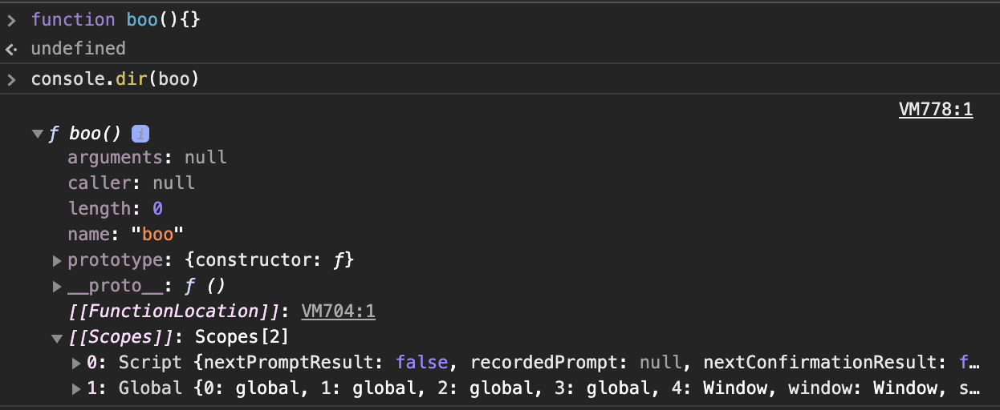
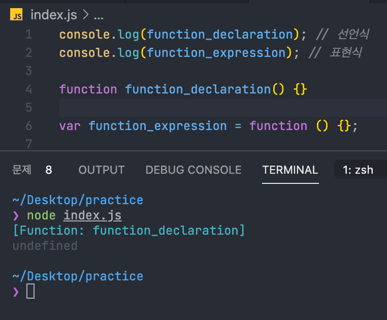

<h1 align="center">실행 컨텍스트 Execution Context</h1>

# Index

- [정의](#정의)
- [실행 컨텍스트의 3가지 프로퍼티](#실행-컨텍스트의-3가지-프로퍼티)
- [실행 컨텍스트의 생성 과정](#실행-컨텍스트의-생성-과정)
  - [전역 코드에의 진입](#10-전역-코드에의-진입)
  - [스코프 체인의 생성과 초기화](#11스코프-체인의-생성과-초기화)
  - [변수 객체화 실행 (feat. hoisting)](#12-변수-객체화-실행-feat-hoisting)
  - [this value 결정](#13-this-value-결정)
- [전역 코드의 실행](#전역-코드의-실행)

## 정의

실행 컨텍스트는 ECMAScript 스펙에 따르면 **실행 가능한 코드를 형상화하고 구분하는 추상적인 개념** 이라고 정의합니다.  
쉽게 말하자면 **코드들이 실행되기 위한 환경입니다.**

```JavaScript
var name = 'minsoo';

function movie(){
    var title = 'movie1';

    function seeMovie(){
        var time = 'now';
        console.log(name + 'saw the '+ movie ' at ' + time);
    }
}

movie();
```

위와 같은 코드가 있다고 가정합시다.

위 코드를 실행하게 되면 **실행 컨텍스트 스택**(EC Stack)이 생성하게 되고 프로그램(앱, 브라우저 등등)이 종료할때 소멸하게 됩니다.
이 스택이 생성되고 난 뒤 전역 컨텍스트가 생성되어 포함이 됩니다.

현재 실행 중인 컨텍스트에서 이 컨텍스트와 관련 없는 코드(예: 다른 함수)가 실행되면 새로운 컨텍스트가 생성이 됩니다. 이 컨텍스트는 스택에 쌓이게 되고 컨트롤(제어권)을 갖게 됩니다.

함수 실행이 끝나게 되면 해당 함수의 실행 컨텍스트를 파기하고 직전의 실행 컨텍스트에게 컨트롤을 반환합니다.

[목차로](#index)

## 실행 컨텍스트의 3가지 프로퍼티

실행 컨텍스트는 실행 가능한 코드를 형상화하고 구분하는 추상적인 개념이지만, _물리적으로는 객체의 형태를 가지며_, 다음과 같은 규칙을 갖게 됩니다.

- 전역 컨텍스트가 하나 생성된 후, 함수 호출 시마다 컨텍스트가 생깁니다.
- 컨텍스트 생성시 컨텍스트는 _Variable Object, Scope Cahin, this_ 이렇게 3가지 프로퍼티를 소유하게 됩니다.
- 컨텍스트 생성 후 함수가 실행되는데, 사용되는 변수들은 변수 객체 안에서 값을 찾고 없다면 스코프 체인을 따라 올라가며 찾습니다.
- 함수 실행이 마무리 되면 해당 컨텍스트는 사라집니다.

[목차로](#index)

### Variable Object (VO / 변수 객체)

실행 컨텍스트가 생성되면 자바스크립트 엔진은 실행에 필요한 여러 정보들을 담을 객체를 생성하는데, 이를 `Variable Object` 라고 합니다.

Variable Object 는 아래와 같은 정보들을 담습니다.

- 변수
- 매개변수(parameter)와 인수 정보(arguments)
- 함수 선언 (함수 표현식은 제외)

아까 예시를 든 코드에서 VO를 객체 형식으로 표현하면 다음과 같습니다.

```javascript
'전역 컨텍스트' : {
    VO: {
        name: 'minsoo', // 전역 변수
        movie: Function Object // 전역 함수
    }
}

// 함수 컨텍스트의 경우
// VO는 Activation Object(AO/ 활성 객체)를 가리키며
// 매개변수와 인수들의 정보를 배열의 형태로 담고 있는 arguments object가 추가됩니다.
'movie': {
    VO: {
        arguments: null,
        title: 'movie1', // 지역변수
        seeMovie: Function Object // 내부 함수
    }
}
```

#### Scope Chain (SC)

스코프 체인은 일종의 **리스트**로서 전역 객체와 중첩된 함수의 스코프의 *레퍼런스*를 차례로 저장하고 있는 것입니다.  
다시 말하자면, 스코프 체인은 해당 전역 또는 함수가 참조할 수 있는 변수, 함수 선언등의 정보를 담고 있는 전역 객체 또는 활성 객체의 리스트를 가리킵니다.

> 스코프 체인은 변수를 검색하는 메커니즘입니다.

예를 들어 함수 내의 코드에서 변수를 참조하려 하면 엔진은 스코프 체인의 첫번째 리스트가 가리키는 AO에 접근하여 변수를 검색하게 됩니다.  
검색에 실패하게되면 다음 리스트가 가리키는 AO를 검색하게 됩니다.  
이와 같이 순차적으로 스코프 체인에서 변수를 검색하는데 결국 검색에 실패하면 정의되지 않은 변수에 접근하는 것으로 판단하여 `Reference` 에러를 발생시키게 되는 것입니다.  
스코프 체인은 함수의 built in 프로퍼티인 `[[Scope]]` 로 참조할 수 있습니다.



#### this

this 프로퍼티에는 this 값이 할당 됩니다.  
this에 할당되는 값은 함수 호출 패턴에 의해 결정됩니다.

## 실행 컨텍스트의 생성 과정

### 1.0 전역 코드에의 진입

프로그램이 실행되면 **실행 컨텍스트 스택**이 생성이 되고 유일한 전역 객체인 **Global Object**(GO)가 생성이 됩니다.  
이 객체의 프로퍼티는 코드의 어떤 곳에서도 접근이 가능하고, 빌트인 객체들인 Mat, Array, String 등과 BOM, DOM 등이 설정되어 있습니다.

전역 객체가 생성된 이후 전역 코드로 컨트롤이 진입하게 되면,  
**전역 실행 컨텍스트**(global EC)가 생성되고 **실행 컨텍스트 스텍**(EC Stack)에 쌓이게 됩니다.

### 1.1 스코프 체인의 생성과 초기화

실행 컨텍스트가 생성이 되면 가장 먼저 스코프 체인의 생성과 초기화가 진행됩니다. 이때 스코프 체인은 **전역 객체**의 레퍼런스를 포함하는 *리스트*가 됩니다.

### 1.2 변수 객체화 실행 (feat. hoisting)

스코프 체인의 생성과 초기화가 종료되면 **Variable Instantiation**(변수 객체화)가 실행됩니다.

> 변수 객체화는 VO에 프로퍼티와 값을 추가하는 것을 의미합니다.

Variable Instantiation(변수 객체화) 는 아래의 순서로 값을 Set 합니다.

> 1. Function Code인 경우 **매개변수**가 VO의 프로퍼티로, **인수**가 값으로 설정됩니다.
> 2. 대상 코드 내의 **함수 선언** 을 대상으로 **함수 명**이 VO의 프로퍼티로 생성된 _함수 객체_ 가 값으로 설정됩니다. (함수 호이스팅)
> 3. 대상 코드 내의 변수 선언을 대상으로 **변수명**이 VO의 프로퍼티로, *undefined*가 값으로 설정됩니다.

따라서 호이스팅은 선언식을 최상단으로 끌어 올리는 것이 아니라는 것을 알 수 있습니다.

변수 객체 (VO)에 함수명을 프로퍼티로 추가하고 즉시 함수 객체가 값에 할당되기 때문에  
함수가 실행되는 순간의 문맥(context)에서 함수가 선언된 위치는 무관하다는 것을 알 수 있습니다.

따라서 함수 표현식을 통해 함수를 정의하게 될 경우에는 호이스팅이 적용되지 않습니다. 표현식의 경우 일반 변수의 방식을 따르기 때문에 **변수명**이 프로퍼티로 **undefined**가 값으로 설정됩니다.



#### 1.2.1 변수 name의 선언처리

변수 선언은 _VI 실행순서 3_ 에 따르면 다음과 같다.

```JavaScript
global_context: {
    VO: {
        arguments: null,
        variable: [{name: undefined}, {movie: Function Object}]
    }
}
```

이제 이 과정을 조금 더 세분화 해보면 다음과 같습니다.

1. 선언단계
   변수 객체(VO)에 변수를 등록한다. 이 변수 객체는 스코프가 참조할 수 있는 대상이 됩니다.
2. 초기화 단계
   변수 객체(VO)에 등록된 변수를 메모리에 할당한다. 이 단계에서 변수는 `undefined` 로 초기화 된다.
3. 할당 단계
   undefined로 초기화된 변수에 실제 값을 할당한다.

여기서 var 키워드로 선언된 변수는 선언단계와 초기화 단계가 한번에 이루어 집니다.  
다시 말하자면, 스코프 체인이 가리키는 변수 객체에 변수가 등록되고 변수는 `undefined` 로 초기화 됩니다.  
따라서 변수 선언문 이전에 변수에 접근하여도 VO에 변수가 존재하기 때문에 에러가 발생하지 않습니다.

> 이러한 현상을 **변수 호이스팅**이라고 합니다.

### 1.3 this value 결정

변수 선언 처리가 끝나면 다음은 this value 가 결정됩니다.  
전역 코드의 경우 this는 전역 객체를 가리키게 됩니다.

[목차로](#index)

## 전역 코드의 실행

전역 변수 `name`에 문자열 'minsoo' 를 할당할 때,  
현재 실행 컨텍스트의 스코프 체인이 참조하고 있는 VO를 선두 (index=0) 부터 검색하여 변수명에 해당하는 프로퍼티가 발견되면 값인 'minsoo'를 할당합니다.

이제부터 전역 코드는 스코프 체인에 등록된 인덱스를 순서대로 검색하여 변수에 값을 할당하게 됩니다.

[목차로](#index)

## 참고 문헌

[zeroCho님 블로그](https://www.zerocho.com/category/Javascript/post/5740531574288ebc5f2ba97e)
[빵속에꼼팡이님 블로그](https://soungnote.tistory.com/18)
[poiemaweb.com](https://poiemaweb.com/js-execution-context)
